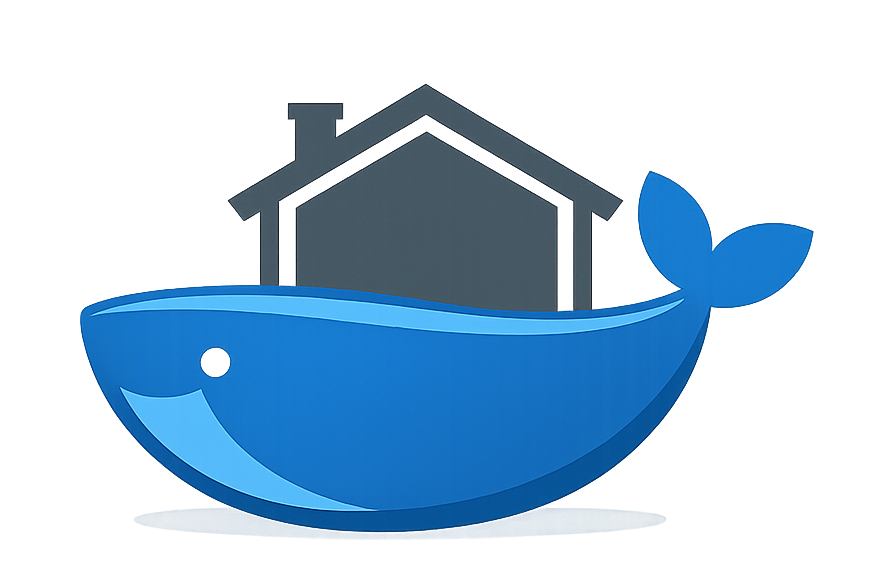

<p align="center">
  
  <h1 align="center">homelab</h1>
  <p align="center">Containerized self-hosted media automation and smart home stack.</p>
</p>

## Services

| Service | Description | Web UI |
|---------|-------------|------|
| [Jellyfin](https://jellyfin.org/) | Media server | [:8096](http://localhost:8096) |
| [Radarr](https://radarr.video/) | Movie automation | [:7878](http://localhost:7878) |
| [Sonarr](https://sonarr.tv/) | TV automation | [:8989](http://localhost:8989) |
| [Prowlarr](https://prowlarr.com/) | Indexer management | [:9696](http://localhost:9696) |
| [qBittorrent](https://www.qbittorrent.org/) | BitTorrent client | [:8080](http://localhost:8080) |
| [Seerr](https://docs.seerr.dev/) | Media requests | [:5055](http://localhost:5055) |
| [WireGuard Easy](https://github.com/wg-easy/wg-easy) | WireGuard VPN + UI | [:51821](http://localhost:51821) |
| [Watchtower](https://watchtower.nickfedor.com/) | Automated updates | — |
| [Beszel](https://beszel.dev/) | Monitoring | [:8090](http://localhost:8090) |
| [AdGuard Home](https://adguard.com/en/adguard-home/overview.html) | DNS filtering | [:3000](http://localhost:3000) |
| [Nginx Proxy Manager](https://nginxproxymanager.com/) | Reverse proxy + SSL | [:81](http://localhost:81) |
| [Cloudflare DDNS](https://github.com/timothymiller/cloudflare-ddns) | Keeps DNS A record updated | — |
| [Zigbee2MQTT](https://www.zigbee2mqtt.io/) | Zigbee to MQTT bridge | [:8081](http://localhost:8081) |
| [Mosquitto](https://mosquitto.org/) | MQTT message broker | — |
| [Home Assistant](https://www.home-assistant.io/) | Home automation platform | [:8123](http://localhost:8123) |

## Requirements

- Docker Engine
- A host with sufficient storage for media and torrents
- A domain (optional, for WireGuard and reverse proxy)

## Quick Start

1. Run `make setup` to verify Docker, create directories, copy default configs, and generate `.env`
2. Edit `.env` and fill in your values
3. Run `make up` to start the stack

Run `make help` to see all available commands.

## Troubleshooting

- **Permission issues:** Verify `PUID`/`PGID` match the owner of `/data` and `/docker/appdata`.
- **Hardware acceleration:** The current compose maps `/dev/dri` and uses `group_add` for `JELLYFIN_RENDER_GROUP`. See Jellyfin's Intel Quick Sync guide for details.
- **Port conflicts:** Make sure host ports (e.g., 80/443 for NPM, 53 for AdGuard) are available and not used by other services on your machine or change the port mappings in `docker-compose.yml`.
- **DNS:** AdGuard runs in `network_mode: host` and binds to port 53. Conflicts may occur if another DNS service is active on the host.
- **Reverse proxy:** NPM listens on 80/443; configure your domain and SSL certificates there. Pair with Cloudflare DNS for external access.
- **Cloudflare DDNS not updating:** Confirm token scope, zone id, and that the mounted config file path matches the compose volume.
- **WireGuard admin login:** Ensure `WG_ADMIN_PASSWORD_HASH` is valid; consult wg-easy documentation for generating hashes.
- **Zigbee2MQTT not starting:** Verify your Zigbee adapter path with `ls -l /dev/serial/by-id/` or `ls /dev/ttyUSB*` and update `ZIGBEE_ADAPTER_PATH` in `.env`. You may need to add your user to the `dialout` group: `sudo usermod -aG dialout $USER`.

## Maintenance

Watchtower runs automatic updates every day at 04:00 and cleans up old images. You can disable or change the schedule via environment variables.

Use `make help` to see all available commands for managing services (logs, status, restart, stop, etc.).

## Useful links

- https://github.com/Ravencentric/awesome-arr
- https://trash-guides.info/
- https://wiki.servarr.com/docker-guide
- https://jellyfin.org/docs/general/administration/hardware-acceleration/intel/#official-docker

## Folder structure

Inspired by this handy [guide](https://trash-guides.info/File-and-Folder-Structure/How-to-set-up/Docker/)

```
/
├── data/                                  # Media and downloads
│   ├── media/                             # Organized media library
│   │   ├── movies/                        # Movies for Jellyfin
│   │   └── tv/                            # TV shows for Jellyfin
│   └── torrents/                          # Download staging area
│       ├── movies/                        # Movie downloads
│       └── tv/                            # TV show downloads
│
└── docker/                                # Docker stack configuration
    ├── .env                               # Environment variables
    ├── docker-compose.yml                 # Main compose file
    ├── env.template                       # Environment variables template
    │
    ├── appdata/                           # Container persistent data
    │   ├── adguard/                       # AdGuard Home config
    │   ├── beszel-hub/                    # Beszel monitoring data
    │   ├── cloudflare-ddns/               # Cloudflare DDNS config
    │   ├── homeassistant/                 # Home Assistant configuration
    │   ├── jellyfin/                      # Jellyfin media server data
    │   ├── mosquitto/                     # Mosquitto MQTT broker config
    │   ├── nginx-proxy-manager/           # NPM proxy config
    │   ├── prowlarr/                      # Prowlarr indexer config
    │   ├── qbittorrent/                   # qBittorrent settings
    │   ├── radarr/                        # Radarr movie automation
    │   ├── seerr/                         # Seerr request data
    │   ├── sonarr/                        # Sonarr TV automation
    │   ├── wg-easy/                       # WireGuard VPN config
    │   └── zigbee2mqtt/                   # Zigbee2MQTT config and database
    │
    └── defaults/                          # Default configuration templates
        ├── cloudflare-ddns/               # Cloudflare DDNS config template
        ├── mosquitto/                     # Mosquitto MQTT config template
        └── zigbee2mqtt/                   # Zigbee2MQTT config template
```
